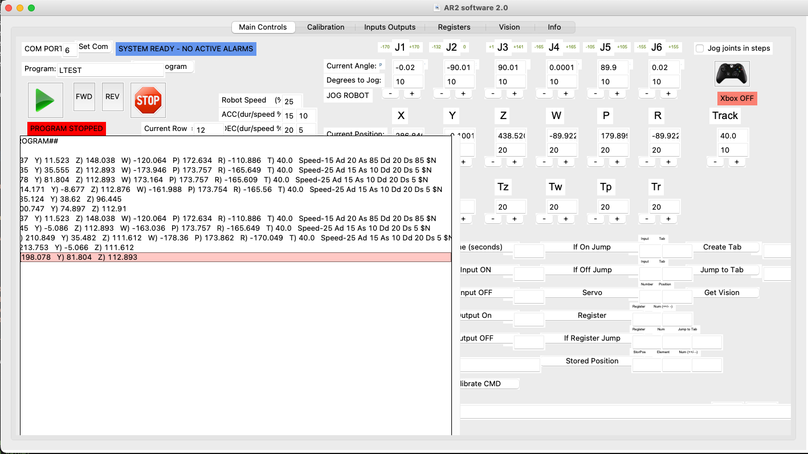

# Robot_Arm_GUI
clone of AR4 software with modification to support running on Mac OS,  original zip https://github.com/Chris-Annin/AR2/blob/master/AR2%202.0%20software%20source%20files.zip

# Usage 
On Mac OS launch this script as: python3 AR2.py
* Requirements: python 3.7.3+
* Requirements: pyserial
* Requirements: tkinter

if fails to import serial run command: pip install pyserial

# GUI as of 3/6/2022
Original AR4 unmodified

